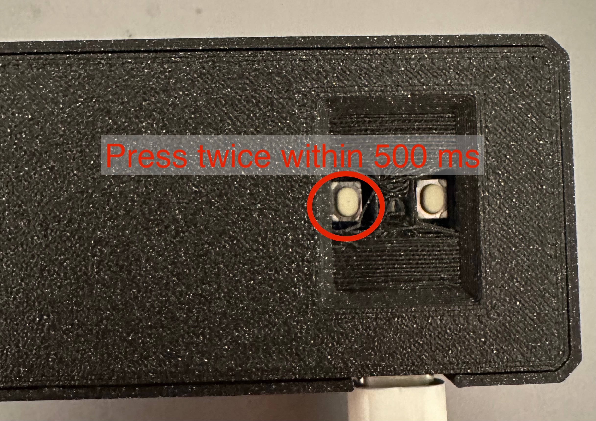

# Updating old devices

The first few devices do not support automatic updates.
This feature has been implemented later. So the update has to be done manually.

## Prepare the device



Push the marked button twice within 500 ms. The led at the bottom (between the buttons) should blink like this:

```
green - green ------- green - green ------ ....

```

On your computer you should see a drive `CIRCIUTPY`.

## Download the release

Get the release from the [Release Page](https://github.com/mutenix-org/firmware-macroboard/releases/latest).

## Extract the release

Extract all the files ending with `.py` in the archive.

## Remove old file(s)

Remove the `code.py` file from the device. (And all files in the archive ending with `.delete`)

## Copy new files

Copy the files extracted from the archive to the device.

## Done
